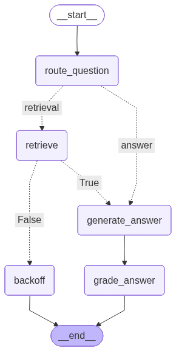

# SH RAG Chat

[](https://img.shields.io/github/v/release/DCC-BS/rag-application)
[](https://github.com/DCC-BS/rag-application/actions/workflows/main.yml?query=branch%3Amain)
[](https://codecov.io/gh/DCC-BS/rag-application)
[](https://img.shields.io/github/commit-activity/m/DCC-BS/rag-application)
[](https://img.shields.io/github/license/DCC-BS/rag-application)

This is a template repository for Python projects that use uv for their dependency management.

- **Github repository**: <https://github.com/DCC-BS/rag-application/>
- **Documentation** <https://DCC-BS.github.io/rag-application/>

## Component Descriptions
* **FastAPI Application**: The main backend service that exposes the RAG API. It handles user authentication, manages the search-and-generation workflow, and serves the final answer to the user.

* **PostgreSQL Database**: Our specialized database powered by Paradedb. It uses pgvector for efficient vector similarity search and pg_search for keyword-based text search, enabling powerful hybrid retrieval. It also stores all document content and role-based access metadata.

* **Embedding & Reranking Services**: Two separate services, likely hosted with vLLM, that provide machine learning models as APIs. The embedding service turns text into numerical vectors, and the reranking service re-orders retrieved results for maximum relevance.

* **Document Ingestion Service**: An automated background worker that processes documents from S3/MinIO storage. It uses docling to extract text, chunks the content, calls the embedding service, and loads everything into the PostgreSQL database. Features include:
  - S3/MinIO bucket monitoring with automatic processing
  - Support for PDF, DOCX, PPTX, HTML, and XLSX files
  - Bucket-based access control with role isolation
  - Document state tracking using S3 object tags
  - Automatic embedding generation and database storage
  - Incremental updates and conflict resolution

* **Azure Entra ID**: Microsoft's cloud-based identity and access management service. We use it to authenticate users and manage roles, which determine which documents a user is allowed to access.

* **DB Migration Runner**: This is not a long-running service, but a crucial startup task. It runs before the main application starts to ensure the database schema is up-to-date. It connects to the database, applies any pending Alembic migrations, and then exits, allowing the main application to launch safely.

## Architecture


## Database Migrations with Alembic
Using a migration tool like Alembic is essential for managing database schema changes in a production environment. It replaces manual schema management and ensures that your database state is version-controlled and repeatable.

### Implementation Across Environments
* Production (Kubernetes): The standard pattern is to use an `InitContainer`. In your application's `Deployment` manifest, you define an `initContainer` that uses your main application image. Its sole command is `alembic upgrade head`. Kubernetes ensures this container runs to completion (successfully applying migrations) before the main application container is started. This guarantees the schema is always correct when your app begins handling traffic.

* Development (Docker Compose): A similar result is achieved using an `entrypoint.sh` wrapper script. This script is set as the `ENTRYPOINT` in your application's `Dockerfile`. It first waits for the database to become available, then runs `alembic upgrade head`, and finally executes the main application command (e.g., `uv run src/rag/app.py --host 0.0.0.0 --port 8080`). This mimics the `InitContainer` behavior by ensuring migrations are run before the server starts.

### General Workflow
1. Initial Setup: Run `alembic init alembic` once. Edit `alembic/env.py` to import your SQLAlchemy models' `Base` metadata.
2. Creating a Migration: When you change your ORM models, run `alembic revision --autogenerate -m "Description of change"`.
3. Applying a Migration: The `alembic upgrade head` command is run automatically on startup by the `InitContainer` (in K8s) or the `entrypoint.sh` script (in Docker Compose).

## Document Ingestion

The application includes an automated document ingestion service that processes files from the filesystem. See the [ingestion documentation](docs/ingestion.md) for detailed information about:

- Setting up the ingestion service
- Supported file formats
- Directory structure and access roles
- Running the service in development and production

## Getting started with your project

#### Pre-requisites

Windows
- Install [Git for Windows](https://git-scm.com/downloads/win)
- Install [Scoop](https://scoop.sh/)
- Install make: `scoop install make`

General
- Install [VSCode](https://code.visualstudio.com/)
- Install [uv](https://docs.astral.sh/uv/getting-started/installation/)

### 1. Create a New Repository

First, create a repository on GitHub with the same name as this project, and then run the following commands:

```bash
git init -b main
git add .
git commit -m "init commit"
git remote add origin git@github.com:DCC-BS/rag-application.git
git push -u origin main
```

### 2. Set Up Your Development Environment

Then, install the environment and the pre-commit hooks with

```bash
make install
```

This will also generate your `uv.lock` file

### 3. Run the pre-commit hooks

Initially, the CI/CD pipeline might be failing due to formatting issues. To resolve those run:

```bash
uv run pre-commit run -a
```

### 4. Commit the changes

Lastly, commit the changes made by the two steps above to your repository.

```bash
git add .
git commit -m 'Fix formatting issues'
git push origin main
```

You are now ready to start development on your project!
The CI/CD pipeline will be triggered when you open a pull request, merge to main, or when you create a new release.

To finalize the set-up for publishing to PyPI, see [here](https://fpgmaas.github.io/cookiecutter-uv/features/publishing/#set-up-for-pypi).
For activating the automatic documentation with MkDocs, see [here](https://fpgmaas.github.io/cookiecutter-uv/features/mkdocs/#enabling-the-documentation-on-github).
To enable the code coverage reports, see [here](https://fpgmaas.github.io/cookiecutter-uv/features/codecov/).


# SH-RAG-Chat

A Python-based RAG (Retrieval-Augmented Generation) chat application with FastAPI backend and authentication support.

## Project Overview

This project implements a chat application with RAG capabilities, using LanceDB for vector storage and FastAPI for the backend API. The application includes user authentication, CLI tools, and a modern UI interface.

## Project Structure

```
sh-rag-chat/
├── src/                      # Source code
│   └── rag/                  # Main application package
│       ├── cli/              # Command-line interface tools
│       │   └── create_user.py  # User creation script
│       ├── conf/             # Configuration files
│       ├── core/             # Core RAG functionality
│       │   ├── rag_pipeline.py  # RAG pipeline implementation
│       │   ├── bento_embeddings.py  # Embedding models
│       │   ├── lance_retriever.py  # LanceDB retriever
│       │   └── rag_states.py  # State management
│       ├── data/             # Application data
│       ├── logs/             # Log files
│       ├── stubs/            # Type stubs
│       ├── ui/               # User interface
│       │   ├── app.py        # Streamlit application
│       │   ├── components/   # UI components
│       │   └── constants.py  # UI constants
│       ├── utils/            # Utility functions
│       ├── auth.py           # Authentication logic
│       ├── main.py           # FastAPI application entry point
│       ├── models.py         # Database models
│       └── setup_lancedb.py  # Vector DB setup
├── data/                     # External data files
│   ├── EL/                   # EL dataset
│   ├── EL2/                  # EL2 dataset
│   ├── SH/                   # SH dataset
│   └── dev/                  # Development data
├── lancedb/                  # LanceDB storage
│   └── documents.lance/      # Vector document storage
├── tests/                    # Test suite
├── docs/                     # Documentation
├── .venv/                    # Virtual environment (generated)
└── various config files      # (.gitignore, pyproject.toml, etc.)
```

## Langchain Graph



## Features

- User Authentication and Authorization
- RAG-based Chat Interface
- Vector Storage with LanceDB
- FastAPI Backend
- CLI Tools for User Management
- Modern UI Components
- Comprehensive Testing Suite

## Technical Stack

- **Backend Framework**: FastAPI
- **Database**: PostgreSQL
- **Vector Storage**: pgvector and pg_search
- **Authentication**: Azure Entra ID
- **Development Tools**:
  - UV (Package Manager)
  - Ruff (Linter)
  - Pyright (Type Checker)

## Installation

1. Clone the repository:
```bash
git clone https://github.com/yourusername/sh-rag-chat.git
cd sh-rag-chat
```

2. Set up the Python environment:
```bash
# Using UV package manager
uv venv
source .venv/bin/activate  # On Unix
# or
.venv\Scripts\activate     # On Windows
```

3. Install dependencies:
```bash
uv pip install -r requirements.txt
```

## Configuration

1. Database Setup:
   - The application uses SQLite by default
   - Database configuration is in `api/models.py`
   - Run migrations using the CLI tools

2. Environment Variables:
   - Copy `.env.example` to `.env`
   - Configure necessary environment variables

## Usage

1. Start the API server:
```bash
# Unix
./api/run.sh

# Windows
./api/run.ps1
```

2. Create a new user:
```bash
python api/cli/create_user.py --username <username> --password <password> --organization <org>
```

3. Access the application:
   - API documentation: http://localhost:8000/docs
   - UI interface: http://localhost:8000

## Development

1. Code Style:
   - Follow PEP 8 guidelines
   - Use type hints
   - Run linter: `ruff check .`
   - Run type checker: `pyright`

2. Testing:
   - Run tests: `pytest api/tests/`
   - Coverage report: `pytest --cov=api`

## API Documentation

The API documentation is available at `/docs` when the server is running. Key endpoints include:

- `/auth/token` - Get authentication token
- `/chat` - Chat endpoint
- `/users` - User management
