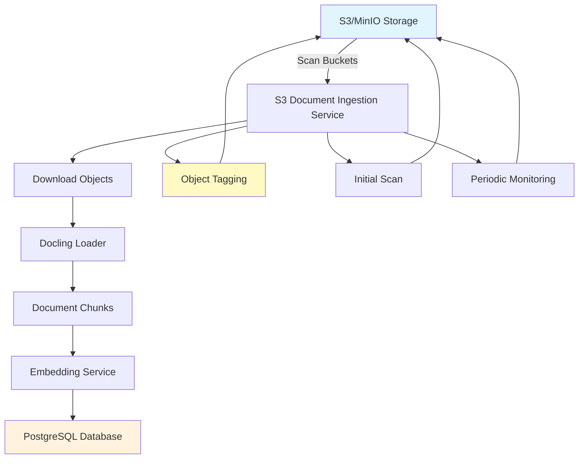

# Document Ingestion Service

The document ingestion service is responsible for automatically processing documents from S3/MinIO storage, creating embeddings, and storing them in the PostgreSQL database.

## Features

- **S3/MinIO Storage**: Monitors S3 buckets for new documents
- **Bucket-Based Access Control**: Uses separate buckets for different access roles
- **Document Tagging**: Tracks processed documents using S3 object tags
- **Document Processing**: Uses Docling to extract text and create document chunks
- **Embedding Generation**: Creates vector embeddings for semantic search
- **Database Storage**: Stores documents and chunks with embeddings in PostgreSQL
- **Change Monitoring**: Periodic scanning for new or updated documents

## Bucket Structure and Access Roles

The ingestion service uses bucket-based isolation for access control:

```
MinIO Buckets:
├── documents-el/          # Access role: "EL"
│   ├── doc1.pdf
│   └── doc2.docx
├── documents-sh/          # Access role: "SH"
│   ├── doc3.pdf
│   └── doc4.pptx
└── documents-el2/         # Access role: "EL2"
    ├── doc5.pdf
    └── doc6.html
```

Each access role gets its own isolated bucket, ensuring documents are properly segmented by access permissions.

## Document Processing State

Documents are tracked using S3 object tags:
- **Unprocessed**: No `ingestion_processed` tag
- **Processed**: Has `ingestion_processed` tag with timestamp
- **Updated**: When source document is modified after processing, it gets reprocessed

## Supported File Formats

- PDF (`.pdf`)
- Microsoft Word (`.docx`)
- Microsoft PowerPoint (`.pptx`)
- HTML (`.html`)
- Microsoft Excel (`.xlsx`) - optional

## Configuration

The ingestion service is configured via the YAML configuration files in `src/rag/conf/`:

```yaml
# ingestion.yaml
INGESTION:
  STORAGE_TYPE: "s3"
  S3_ENDPOINT: "${oc.env:MINIO_ENDPOINT}"
  S3_ACCESS_KEY: "${oc.env:MINIO_ROOT_USER}"
  S3_SECRET_KEY: "${oc.env:MINIO_ROOT_PASSWORD}"
  S3_BUCKET_NAME: "${oc.env:S3_BUCKET_NAME,rag-bot}"
  WATCH_ENABLED: true
  BATCH_SIZE: 10
  SCAN_INTERVAL: 3600
  PROCESSED_TAG: "ingestion_processed"
```

## Running the Service

### Development

```bash
# Ensure MinIO is running with proper credentials
# Set environment variables:
export MINIO_ROOT_USER=minioadmin
export MINIO_ROOT_PASSWORD=minioadmin
export MINIO_ENDPOINT=http://localhost:9000

# Run the ingestion service
./run_ingestion.sh
```

### Docker Compose

The ingestion service runs automatically as part of the Docker Compose stack:

```bash
docker-compose up rag-ingestion
```

## Service Architecture



## Bucket Management

The service automatically:
- Creates required buckets on startup if they don't exist
- Ensures proper isolation between access roles

## Document State Management

### Processing Flow
1. **Discovery**: Service scans buckets for documents
2. **Check Processing State**: Looks for `ingestion_processed` tag
3. **Download**: Downloads unprocessed or updated documents
4. **Process**: Extracts text using Docling, creates embeddings
5. **Store**: Saves to PostgreSQL database
6. **Tag**: Marks document as processed with timestamp

### Update Detection
- Compares S3 object `LastModified` time with database record creation time
- If S3 object is newer, removes processed tag and reprocesses
- Maintains data consistency between S3 and database

## Database Schema

The service works with two main database tables:
- **documents**: Stores document metadata and access roles (document_path contains S3 URI)
- **document_chunks**: Stores text chunks with their embeddings

## Logging

The service uses structured logging with JSON output for production environments. Key log events include:

- S3 connection establishment
- Bucket creation and scanning
- Document processing start/completion
- Object tagging operations
- Database operations
- Error conditions

## Error Handling

The service handles various error conditions gracefully:

- S3 connectivity issues
- Missing or corrupted objects
- Embedding service unavailability
- Database connection issues
- Unsupported file formats
- Permission errors

Failed documents are logged but don't stop the service from processing other files.

## Performance Considerations

- Documents are downloaded temporarily and cleaned up after processing
- Object tagging provides efficient state tracking without database queries
- Bucket-based access control provides natural isolation
- Periodic scanning interval can be adjusted based on ingestion frequency
- GPU acceleration is used when available for document processing

## Troubleshooting

### Common Issues

1. **Service won't start**: Check S3/MinIO connectivity and credentials
2. **Buckets not created**: Verify S3 permissions and bucket naming
3. **Files not being processed**: Check object tagging and supported formats
4. **Slow processing**: Check S3 network connectivity and embedding service performance
5. **Database errors**: Verify PostgreSQL connection and table creation

### Logs

Check service logs for detailed error information:

```bash
# Docker Compose
docker-compose logs rag-ingestion

# Direct execution
uv run src/rag/cli/run_ingestion.py
```

### S3/MinIO Management

Access MinIO console at `http://localhost:9001` to:
- View buckets and objects
- Check object metadata and tags
- Monitor storage usage
- Manage access policies

## Migration from File System

To migrate from the previous file system approach:

1. **Upload existing documents** to appropriate S3 buckets:
   ```bash
   # Example: Upload EL documents to documents-el bucket
   aws s3 cp data/EL/ s3://documents-el/ --recursive --endpoint-url http://localhost:9000
   ```

2. **Clear processed tags** if you want to reprocess:
   ```bash
   # Remove all tags from objects (forces reprocessing)
   aws s3api put-object-tagging --bucket documents-el --key document.pdf --tagging TagSet=[] --endpoint-url http://localhost:9000
   ```

3. **Run initial scan** to process uploaded documents
