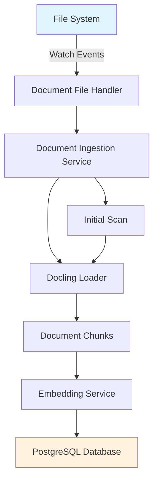

# Document Ingestion Service

The document ingestion service is responsible for automatically processing documents from the file system, creating embeddings, and storing them in the PostgreSQL database.

## Features

- **Automatic File Detection**: Monitors specified directories for new documents
- **File Watching**: Real-time detection of file changes using filesystem events
- **Document Processing**: Uses Docling to extract text and create document chunks
- **Embedding Generation**: Creates vector embeddings for semantic search
- **Role-Based Access**: Automatically assigns access roles based on directory structure
- **Database Storage**: Stores documents and chunks with embeddings in PostgreSQL

## Directory Structure and Access Roles

The ingestion service determines access roles from the directory structure:

```
data/
├── EL/          # Access role: "EL"
│   ├── doc1.pdf
│   └── doc2.docx
├── SH/          # Access role: "SH"
│   ├── doc3.pdf
│   └── doc4.pptx
└── EL2/         # Access role: "EL2"
    ├── doc5.pdf
    └── doc6.html
```

## Supported File Formats

- PDF (`.pdf`)
- Microsoft Word (`.docx`)
- Microsoft PowerPoint (`.pptx`)
- HTML (`.html`)
- Microsoft Excel (`.xlsx`) - optional

## Configuration

The ingestion service is configured via the YAML configuration files in `src/rag/conf/`:

```yaml
# ingestion.yaml
INGESTION:
  DATA_DIR: "data"
  WATCH_ENABLED: true
  BATCH_SIZE: 10
  SCAN_INTERVAL: 3600

DATA_DIR: "data"
```

## Running the Service

### Development

```bash
# Create data directories
mkdir -p data/{EL,SH,EL2}

# Run the ingestion service
./run_ingestion.sh
```

### Docker Compose

The ingestion service runs automatically as part of the Docker Compose stack:

```bash
docker-compose up rag-ingestion
```

## Service Architecture



## Database Schema

The service works with two main database tables:

- **documents**: Stores document metadata and access roles
- **document_chunks**: Stores text chunks with their embeddings

## Logging

The service uses structured logging with JSON output for production environments. Key log events include:

- Document processing start/completion
- File system events (create, modify, delete)
- Embedding generation
- Database operations
- Error conditions

## Error Handling

The service handles various error conditions gracefully:

- Missing or corrupted files
- Embedding service unavailability
- Database connection issues
- Unsupported file formats

Failed documents are logged but don't stop the service from processing other files.

## Performance Considerations

- Documents are processed in batches to optimize embedding generation
- File watching is efficient and doesn't perform full directory scans continuously
- Initial scans can be disabled if the database is already populated
- GPU acceleration is used when available for document processing

## Troubleshooting

### Common Issues

1. **Service won't start**: Check database connectivity and embedding service availability
2. **Files not being processed**: Verify file permissions and supported formats
3. **Slow processing**: Check GPU availability and embedding service performance
4. **Database errors**: Verify PostgreSQL connection and table creation

### Logs

Check service logs for detailed error information:

```bash
# Docker Compose
docker-compose logs rag-ingestion

# Direct execution
uv run src/rag/cli/run_ingestion.py
```
